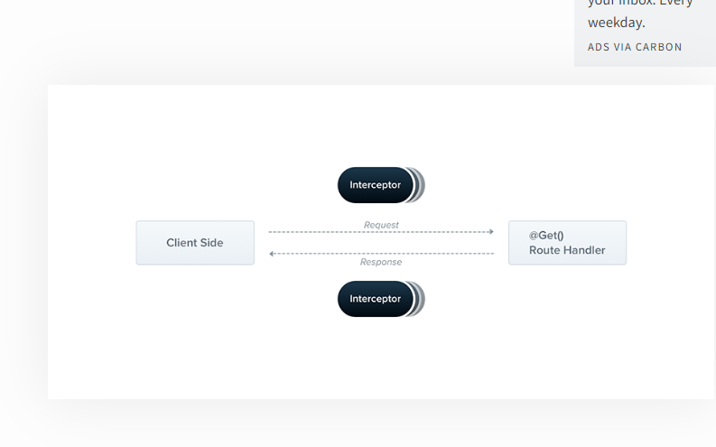

# Interceptor:



- can handle requests and responese
- when client request interceptors can see the request and before sending the response to the cline interceptor can modu=ify the data
- like adding some data or removing some sensible data like password before sending to the client.

## setup:

### 1.create a file in src folder -> transformer.interceptor.ts

```js

import {
  CallHandler,
  ExecutionContext,
  Injectable,
  NestInterceptor,
} from '@nestjs/common';
import { Observable } from 'rxjs';
import { tap } from 'rxjs/operators';

@Injectable()
export class TransformInterceptor implements NestInterceptor {
  intercept(
    context: ExecutionContext,
    next: CallHandler<any>,
  ): Observable<any> | Promise<Observable<any>> {
    // throw new Error('Method not implemented.');
    console.log('Before...');

    const now = Date.now();
    return next
      .handle()
      .pipe(tap(() => console.log(`After... ${Date.now() - now}ms`)));
  }
}

// map--> rxjs--->It takes each emitted value and applies a function to it, returning a new observable with the transformed data.
// tap--> rxjs---> Allows you to perform side effects for notifications from the observable without changing the data.
// pipe--> allows to to transform or manipulate the data, apply filtering, or perform side effects with operators like map, filter, and tap.
// subscribe: Starts the execution of the observable and handles emitted values, errors, and completion.
// forEach: Iterates over emitted values, but it's not as widely used with observables as subscribe
// pipe: Used for preparing and transforming data streams without execution.
// subscribe: Used to execute the observable and handle the emitted values, errors, and completion.

```

### 2.then add in main.ts for gloabal use or in controller level for the controller level

```js
app.useGlobalInterceptors(new TransformInterceptor());
```

### 3.also provide in the appmodule.ts

```js
  {
      provide: APP_INTERCEPTOR,
      useClass: TransformInterceptor,
    },
```

<br>

- the created interceptor class implemets an interface(NestInterceptor).
- and there should a method inside it called intercept which has two parameters.
- one is Execution context--> which holds the info about request
- other is CallHandler---> which is used to manuplate the data before sending to the client and also info about the next request
- # Handle:

  - is used to handle the request
  - after handle can use --> pipe,subscribe and foreach
  - ## pipe:
    - used to manuplate or transform the data emitted by the observable without executing the observable
  - ## subscribe:

    - will hold of emitted values and executes the observable

  - ## foreach:
    - to iterate through the value
  - ### Observable:
    - Observables are lazy, meaning they don’t do anything until you subscribe to them

# Generating Excel download:

- for excel we need to download ExcelJS
- 1. need to create a workbook ( const workbook = new ExcelJS.Workbook();)

- 2. then need to create a worksheet in that workbook (const worksheet = workbook.addWorksheet('Book');)

- 3. then create columns( const headers = JSON.parse(process.env.EXCEL_HEADERS);

  worksheet.columns = Object.keys(headers).map((key) => ({
  header: headers[key],
  key,
  }));)

- 4. add rows worksheet.addRow({
     title: book.title,
     description: book.description,
     author: book.author,
     price: book.price,
     category: book.category,
     });
- 5. then wrtite into one buffer and return it, why coz if we write it into buffer that will write in the memory not in the harddisk so the it is easy to download to store temporarly ( const buffer = await workbook.xlsx.writeBuffer();
     return buffer;)
